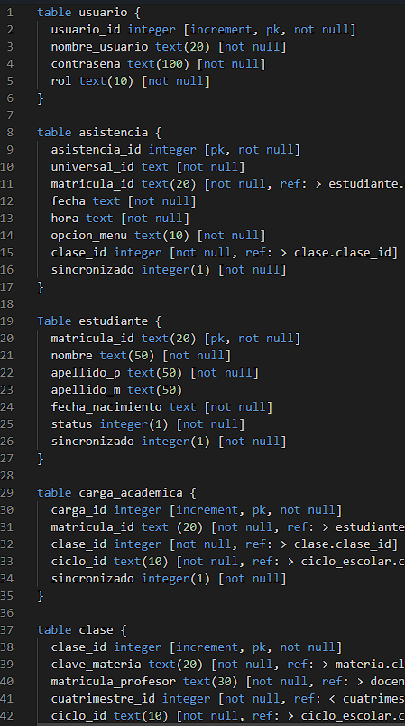
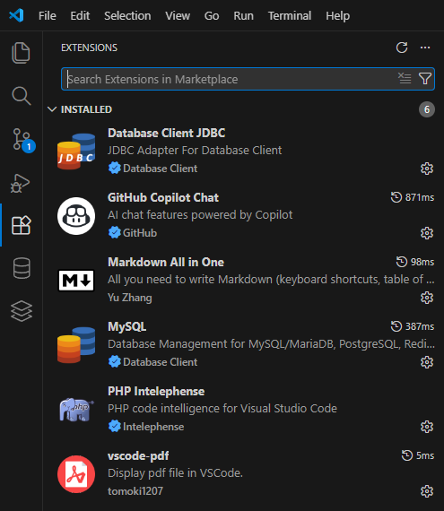
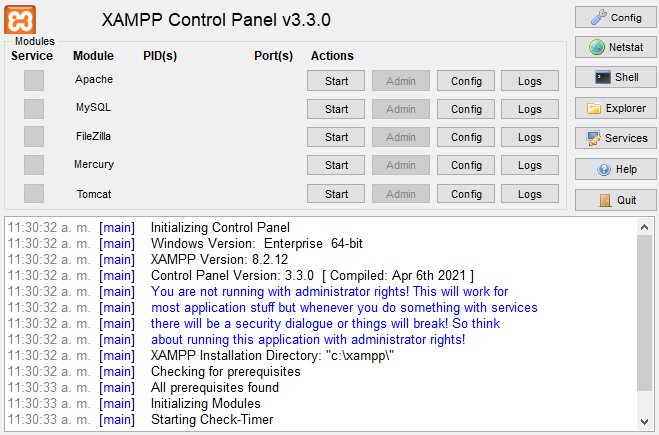
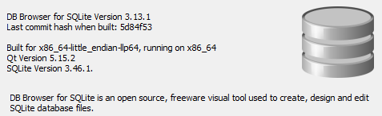
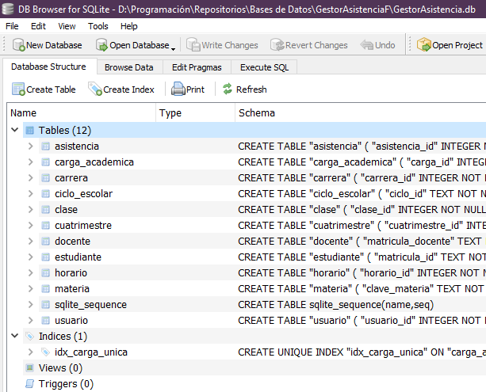
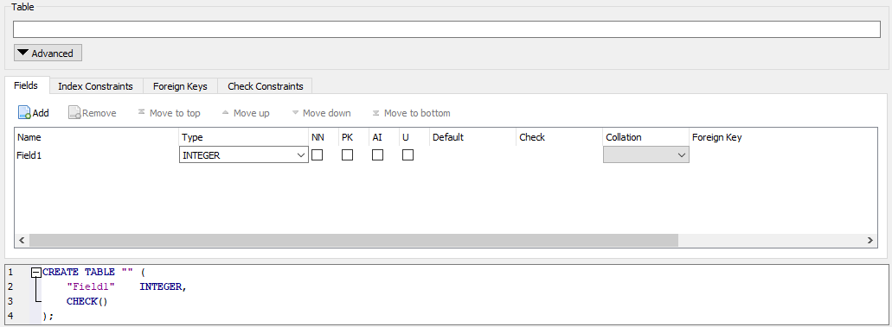
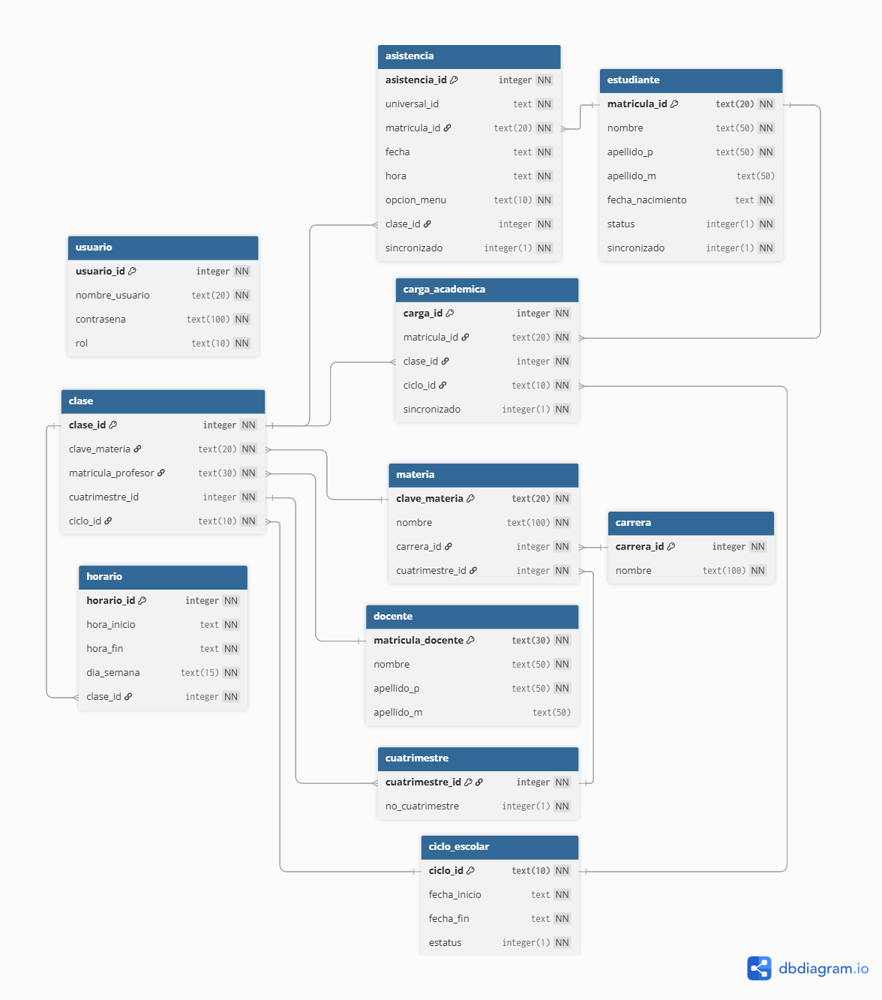
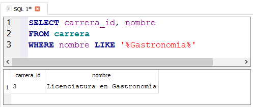
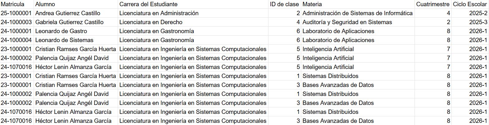

<p align="center">
  <a href="https://git.io/typing-svg"></a>
  <br>
  <a href="https://git.io/typing-svg"></a>
</p>

La arquitectura de esta base de datos ha sido normalizada para garantizar la integridad y persistencia de la información, asegurando que cada asistencia sea comprobable y cumpla con las reglas de la institución.

<p align='center'>
	
	
	
	
	
</p>

# ⚙ Herramientas utilizadas:

* ### [dbdiagram](https://dbdiagram.io/home)

Plataforma online que trabaja con un Lenguaje Específico de Dominio (DSL) sencillo (DBML), para la generación de diagramas entidad-relación (ER).



* ### [Google Sheets](https://workspace.google.com/intl/es-419_mx/products/sheets/)

<p>
  <a href="https://htmlpreview.github.io/?https://github.com/GlaciusLAG/LAG_BD/blob/main/Proyecto_GA/src/diccionario.html" target="_blank">
    
  </a>
</p>

* ### [Visual Studio Code](https://code.visualstudio.com/download)
    * Versión 1.109.5
    + Extensiones
        * PHP IntelliSense (Intelephense)
        * MySQL (Database Client)

|

* ### [XAMPP](https://www.apachefriends.org/es/download.html)
    + Ecosistema
        - XAMPP (centro de control)
        - MySQL
        - phpMyAdmin
        - PHP
    * Versión (8.2.12 / PHP 8.2.12)
  




* ### [DB Browser for SQLite](https://sqlitebrowser.org/dl/)
    * Versión 3.13.1







# 📐 Diagrama Entidad-Relación


<p>
  <a href="src/diagrama.pdf" target="_blank">
    
    <br>
  </a>
</p>

# 🔑 Creación de la BD en SQLite

<p>
  <a href="https://github.com/GlaciusLAG/LAG_BD/raw/main/Proyecto_GA/src/tu_archivo.db">
    
  </a>
</p>

<table>
  <tr>
    <td> Base de Datos
    </td>
    <td> <b>GestorAsistencia.db</b>
  </tr>
</table>

###	Conceptos importantes en la base de datos.
- GLOB
- IN
- LIKE
- CHECK
- CONSTRAINT
- sqlite_secuence
- `%`
- ALTER TABLE
  - ADD COLUMN
- UNION ALL
- Subconsulta
- JOIN
- Alias
- Concatenación `||`
- View
- CASE / END

## Estructuras de las tablas:

- ### **carrera**
```sql
CREATE TABLE "carrera" (
	"carrera_id"	INTEGER NOT NULL,
	"nombre"	TEXT NOT NULL UNIQUE,
	PRIMARY KEY("carrera_id" AUTOINCREMENT)
);
```

---

- ### **cuatrimestre**
Uso de `CONSTRAINT` / `CHECK`
```sql
CREATE TABLE "cuatrimestre" (
	"cuatrimestre_id"	INTEGER NOT NULL,
	"no_cuatrimestre"	INTEGER NOT NULL,
	PRIMARY KEY("cuatrimestre_id" AUTOINCREMENT),
	CONSTRAINT "error_numero_invalido" CHECK("no_cuatrimestre" >= 1 AND "no_cuatrimestre" <= 9)
);
```

---

- ### **docente**
```sql
CREATE TABLE "docente" (
	"matricula_docente"	TEXT NOT NULL,
	"nombre"	TEXT NOT NULL,
	"apellido_p"	TEXT NOT NULL,
	"apellido_m"	TEXT,
	PRIMARY KEY("matricula_docente")
	CONSTRAINT "error_formtato_matricula_docente" CHECK ("matricula_docente" GLOB '[A-Z][0-9][0-9][0-9][0-9][0-9][A-Z]')
);
```

---

- ### **materia**
```sql
CREATE TABLE "materia" (
	"clave_materia"	TEXT NOT NULL,
	"nombre"	TEXT NOT NULL,
	"carrera_id"	INTEGER NOT NULL,
	"cuatrimestre_id"	INTEGER NOT NULL,
	PRIMARY KEY("clave_materia"),
	FOREIGN KEY("carrera_id") REFERENCES "carrera"("carrera_id"),
	FOREIGN KEY("cuatrimestre_id") REFERENCES "cuatrimestre"("cuatrimestre_id"),
	CHECK("clave_materia" GLOB 'LISC-[0-9][0-9][0-9][0-9]')
);
```

---

- ### **ciclo_escolar**

Uso de la clausula `GLOB`
```sql
CREATE TABLE "ciclo_escolar" (
	"ciclo_id"	TEXT NOT NULL,
	"fecha_inicio"	TEXT NOT NULL,
	"fecha_fin"	TEXT NOT NULL,
	"estatus"	INTEGER NOT NULL DEFAULT 1,
	PRIMARY KEY("ciclo_id"),
	CONSTRAINT "error_formato_ciclo" CHECK("ciclo_id" GLOB '[0-9][0-9][0-9][0-9]-[1-3]'),
	CONSTRAINT "error_fecha_fin" CHECK("fecha_inicio" < "fecha_fin"),
	CONSTRAINT "error_formato_fecha" CHECK("fecha_inicio" GLOB '[0-9][0-9][0-9][0-9]-[0-1][0-9]-[0-3][0-9]' AND "fecha_fin" GLOB '[0-9][0-9][0-9][0-9]-[0-1][0-9]-[0-3][0-9]')
);
```

---

- ### **clase**
```sql
CREATE TABLE "clase" (
	"clase_id"	INTEGER NOT NULL,
	"clave_materia"	TEXT NOT NULL,
	"matricula_docente"	TEXT NOT NULL,
	"cuatrimestre_id"	INTEGER NOT NULL,
	"ciclo_id"	TEXT NOT NULL,
	PRIMARY KEY("clase_id" AUTOINCREMENT),
	FOREIGN KEY("ciclo_id") REFERENCES "ciclo_escolar"("ciclo_id"),
	FOREIGN KEY("clave_materia") REFERENCES "materia"("clave_materia"),
	FOREIGN KEY("cuatrimestre_id") REFERENCES "cuatrimestre"("cuatrimestre_id"),
	FOREIGN KEY("matricula_docente") REFERENCES "docente"("matricula_docente")
);
```

---

- ### **horario**
Uso de la clausula `IN`

(`IN` como manejo de booleans)
```sql
CREATE TABLE "horario" (
	"horario_id"	INTEGER NOT NULL,
	"hora_inicio"	TEXT NOT NULL,
	"hora_fin"	TEXT NOT NULL,
	"dia_semana"	TEXT NOT NULL,
	"clase_id"	INTEGER NOT NULL,
	PRIMARY KEY("horario_id" AUTOINCREMENT),
	FOREIGN KEY("clase_id") REFERENCES "clase"("clase_id"),
	CONSTRAINT "error_formato_horario_inicio" CHECK("hora_inicio" GLOB '[0-2][0-9]:[0-5][0-9]:[0-5][0-9]'),
	CONSTRAINT "error_formato_horario_fin" CHECK("hora_fin" GLOB '[0-2][0-9]:[0-5][0-9]:[0-5][0-9]'),
	CONSTRAINT "error_horario_fin" CHECK("hora_inicio" < "hora_fin"),
	CONSTRAINT "error_dia_semana" CHECK("dia_semana" IN ('Lunes', 'Martes', 'Miércoles', 'Jueves', 'Viernes'))
);
```

---

- ### **estudiante**
```sql
CREATE TABLE "estudiante" (
	"matricula_id"	TEXT NOT NULL,
	"nombre"	TEXT NOT NULL,
	"apellido_p"	TEXT NOT NULL,
	"apellido_m"	TEXT,
	"fecha_nacimiento"	TEXT NOT NULL,
	"estatus"	INTEGER NOT NULL DEFAULT 1,
	"sincronizado"	INTEGER NOT NULL DEFAULT 0,
	PRIMARY KEY("matricula_id"),
	CONSTRAINT "error_estudiante_nacimiento" CHECK("fecha_nacimiento" GLOB '[0-9][0-9][0-9][0-9]-[0-1][0-9]-[0-3][0-9]'),
	CONSTRAINT "error_estudiante_estatus" CHECK("estatus" IN (0,1)),
	CONSTRAINT "error_estudiante_sincronizado" CHECK("sincronizado" IN (0,1)),
	CONSTRAINT "error_formato_matricula" CHECK("matricula_id" GLOB '[0-9][0-9]-[0-9][0-9][0-9][0-9][0-9][0-9][0-9]')
);
```

---

- ### **carga_academica**
Creación de `UNIQUE INDEX`
```sql
CREATE TABLE "carga_academica" (
	"carga_id"	INTEGER NOT NULL,
	"matricula_id"	TEXT NOT NULL,
	"clase_id"	INTEGER NOT NULL,
	"ciclo_id"	TEXT NOT NULL,
	"sincronizado"	INTEGER NOT NULL DEFAULT 0,
	PRIMARY KEY("carga_id" AUTOINCREMENT),
	FOREIGN KEY("ciclo_id") REFERENCES "ciclo_escolar"("ciclo_id"),
	FOREIGN KEY("clase_id") REFERENCES "clase"("clase_id"),
	FOREIGN KEY("matricula_id") REFERENCES "estudiante"("matricula_id"),
	CONSTRAINT "error_carga_academica_sincronizado" CHECK("sincronizado" IN (0, 1))
);

CREATE UNIQUE INDEX "idx_carga_unica" ON "carga_academica" ("matricula_id", "clase_id", "ciclo_id");
```

---

- ### **asistencia**
```sql
CREATE TABLE "asistencia" (
	"asistencia_id"	INTEGER NOT NULL,
	"universal_id"	TEXT NOT NULL,
	"matricula_id"	TEXT NOT NULL,
    "fecha" TEXT NOT NULL DEFAULT (date('now', 'localtime')),
    "hora" TEXT NOT NULL DEFAULT (time('now', 'localtime')),
	"opcion_menu"	TEXT NOT NULL,
	"clase_id"	INTEGER,
	"sincronizado"	INTEGER NOT NULL DEFAULT 0,
	PRIMARY KEY("asistencia_id" AUTOINCREMENT),
	FOREIGN KEY("clase_id") REFERENCES "clase"("clase_id"),
	FOREIGN KEY("matricula_id") REFERENCES "estudiante"("matricula_id"),
	CONSTRAINT "error_formato_fecha" CHECK("fecha" GLOB '[0-9][0-9][0-9][0-9]-[0-1][0-9]-[0-3][0-9]'),
	CONSTRAINT "error_formato_hora" CHECK("hora" GLOB '[0-2][0-9]:[0-5][0-9]:[0-5][0-9]'),
	CONSTRAINT "error_asistencia_opcion_menu" CHECK("opcion_menu" IN ('entrada', 'salida', 'horario')),
	CONSTRAINT "error_asistencia_sincronizado" CHECK("sincronizado" IN (0, 1))
);
);
```

---

- ### **usuario**
```sql
CREATE TABLE "usuario" (
	"usuario_id"	INTEGER NOT NULL,
	"nombre_usuario"	TEXT NOT NULL,
	"contrasena"	TEXT NOT NULL,
	"rol"	TEXT NOT NULL,
	PRIMARY KEY("usuario_id" AUTOINCREMENT),
	CONSTRAINT "error_nombre_rol" CHECK("rol" IN ('consultor', 'admin'))
);
```

---

# 📄 Captura de datos
Dentro del software DB Browser, se ejecutarón los scripts de captura de datos dentro de la pestaña ***Execute SQL*** para cada una de las tablas _"maestras"_ de inicio.

Los campos con valores por default son omitidos en la captura de datos.

Estructura básica para la captura de datos:
```SQL
INSERT INTO nombre_tabla (columna1, columna2, ...) VALUES (valor1, valor2, ...);
```

- Ejemplo de script:
```SQL
INSERT INTO estudiante (
	matricula_id,
	nombre,
	apellido_p,
	apellido_m,
	fecha_nacimiento
)
VALUES (
	'24-1070016',
	'Héctor Lenin',
	'Almanza',
	'García',
	'1996-06-13'
);
```

- Verificación de restricción `GLOB` (error_formato_matricula)


## Tablas madre:

- ### **estudiante**
```SQL
INSERT INTO estudiante (matricula_id, nombre, apellido_p, apellido_m, fecha_nacimiento)
VALUES
	('23-1000001', 'Cristian Ramses', 'García', 'Huerta', '2006-01-01'),
	('25-1000001', 'Andrea', 'Gutierrez', 'Castillo', '2006-01-01'),
	('24-1000002', 'Palencia Quijaz', 'Angél', 'David', '2006-01-01')
	('24-1070016', 'Héctor Lenin', 'Almanza', 'García', '1996-06-13'),
	('24-1000001', 'Leonardo', 'de', 'Gastro', '2005-01-01'),
	('24-1000003', 'Gabriela', 'Gutierrez', 'Castillo', '2003-01-01'),
	('24-1000004', 'Leonardo', 'de', 'Sistemas', '2006-01-01'),
	('25-1000005', 'Cristina', 'de', 'C de la E', '2006-01-01'),
	('25-1070010', 'Marlon', 'de', 'conta', '2005-01-01');
```
La tabla estudiante fue actualizada, ya que cada estudiante no pertenecía a una carrera hasta ser registrado en la tabla **carga_academica**.
El problema radica en la filtración de estudiantes, ya que al no pertenecer a una carrera, no es posible filtrarlos.

Por ello, se ejecutó el siguiente script, para crear un campo `FK` a la tabla **carrera**:
  
  Este campo debe permitir **NULL** si hay registros existentes:
```SQL
ALTER TABLE estudiante
	ADD COLUMN carrera_id INTEGER
	REFERENCES carrera (carrera_id);
```
  Para visualizar los registros de estudiantes y al mismo tiempo el listado de carreras existentes para conocer los `IDs` correspondientes, utilizamos `UNION ALL`.
```SQL
SELECT 
	matricula_id AS ID,
	(nombre || ' ' || apellido_p) AS Estudiante,
	'ESTUDIANTE' AS Tipo
FROM estudiante
UNION ALL
SELECT
	carrera_id AS ID,
	nombre AS Carrera,
	'CARRERA' AS Tipo
FROM carrera;
```
- Actualización a registros existentes:
Para asignar valores a un registro ya existente untilizamos `UPDATE`
```SQL
UPDATE estudiante 
SET carrera_id = 1 
WHERE nombre LIKE '%Cristian%' 
   OR nombre LIKE '%Palencia%' 
   OR nombre LIKE '%Héctor%';
UPDATE estudiante SET carrera_id = 2 WHERE nombre = 'Andrea';
UPDATE estudiante SET carrera_id = 3 WHERE nombre = 'Leonardo';
UPDATE estudiante SET carrera_id = 4 WHERE nombre = 'Gabriela';
UPDATE estudiante SET carrera_id = 5 WHERE nombre = 'Cristina';
UPDATE estudiante SET carrera_id = 6 WHERE nombre = 'Marlon';
```
Con los datos actualizados, mediante la interfaz de modificación de tabla de DB Browser, se fija la el campo **carrera_id** como `NOT NULL`.

- ### **cuatrimestre**
```SQL
INSERT INTO cuatrimestre (no_cuatrimestre)
VALUES (1), (2), (3), (4), (5), (6), (7), (8), (9);
```

- ### **ciclo_escolar**
```sql
INSERT INTO ciclo_escolar (ciclo_id, fecha_inicio, fecha_fin)
VALUES
	('2025-1', '2025-01-01', '2025-04-30'),
	('2025-2', '2025-05-01', '2025-08-31'),
	('2025-3', '2025-09-01', '2025-12-31'),
	('2026-1', '2026-01-01', '2026-04-30'),
	('2026-2', '2026-05-01', '2026-08-31'),
	('2026-3', '2026-09-01', '2026-12-31');
```

- ### **carrera**
```sql
INSERT INTO carrera (nombre)
VALUES
	('Licenciatura en Ingeniería en Sistemas Computacionales'),
	('Licenciatura en Administración'),
	('Licenciatura en Gastronomía'),
	('Licenciatura en Derecho'),
	('Licenciatura en Ciencias de la Educación'),
	('Licenciatura en Contaduría');
```

- ### **docente**
```sql
INSERT INTO docente (matricula_docente, nombre, apellido_p, apellido_m)
VALUES
	('A00001S', 'Alfredo', 'Benigno', 'Ramos'),
	('D00001G', 'Dante', 'de', 'Gastronomía'),
	('M00001C', 'Marco', 'de', 'Contaduría'),
	('C00001A', 'Carolina', 'de', 'Administración'),
	('L00001D', 'Luis', 'de', 'Derecho'),
	('F00001S', 'Fabián', 'Arias', 'Cruz');
```

---

## Tablas Hijas
La captura de datos dentro de estas tablas, dependen de llaves foraneas (`FK`) de las tablas madre.

En los campos correspondientes a las llaves foraneas será necesario identificar cada `ID` para su correcta referencia, por ejemplo, llenar la tabla ***clase*** requerirá identificar el `ID` de la materia correspondiente de entre todas las materias registradas. Este proceso puede tomar mucho tiempo en la identificacion de un identificador si hay muchos datos registrados.

Para obtener los datos necesarios de manerá rápida y de esta forma agilizar su captura, se utiliza la siguiente `query`
```SQL
SELECT NombreCampoID, nombre
FROM tabla
WHERE nombre LIKE '%ValorNombre%'
```
Esta `query` nos permite identificar de manera rápida el valor `ID` de un **registro** específico.



### Uso de **subconsultas** `SELECT` dentro de un `INSERT`
El uso de subconsultas dentro del mismo `INSERT` puede agilizar en algunos casos la obtención del `ID` de algun registro, dejando que **SQL** lo inserte de manera directa:

- ### **materia**
```SQL
INSERT INTO materia (clave_materia, nombre, cuatrimestre_id, carrera_id)
VALUES
	('LISC-0843', 'Sistemas Distribuidos', 8,
		(SELECT carrera_id FROM carrera WHERE nombre = 'Licenciatura en Ingeniería en Sistemas Computacionales')),
	('LISC-0844', 'Administración de Sistemas de Informática', 4,
		(SELECT carrera_id FROM carrera WHERE nombre = 'Licenciatura en Administración')),
	('LISC-0845', 'Bases Avanzadas de Datos', 8,
		(SELECT carrera_id FROM carrera WHERE nombre = 'Licenciatura en Ingeniería en Sistemas Computacionales')),
	('LISC-0846', 'Auditoría y Seguridad en Sistemas', 2,
		(SELECT carrera_id FROM carrera WHERE nombre = 'Licenciatura en Derecho')),
	('LISC-0847', 'Inteligencia Artificial', 7,
		(SELECT carrera_id FROM carrera WHERE nombre = 'Licenciatura en Ingeniería en Sistemas Computacionales')),
	('LISC-0848', 'Laboratorio de Aplicaciones', 8,
		(SELECT carrera_id FROM carrera WHERE nombre = 'Licenciatura en Gastronomía'));
```

- ### **clase**
```SQL
INSERT INTO clase (clave_materia, matricula_docente, cuatrimestre_id, ciclo_id)
VALUES
	('LISC-0843', 'A00001S', 8, '2026-1'),
	('LISC-0844', 'C00001A', 4, '2025-2'),
	('LISC-0845', 'F00001S', 8, '2026-1'),
	('LISC-0846', 'L00001D', 2, '2025-3'),
	('LISC-0847', 'A00001S', 8, '2026-1'),
	('LISC-0848', 'D00001G', 8, '2026-1');
```

- ### **horario**
```SQL
INSERT INTO horario (clase_id, hora_inicio, hora_fin, dia_semana)
VALUES
	(1, '15:00:00', '17:00:00', 'Jueves'),
		(1, '15:00:00', '16:00:00', 'Viernes'),
	(2, '13:00:00', '14:00:00', 'Jueves'),
		(2, '13:00:00', '15:00:00', 'Viernes'),
	(3, '16:00:00', '17:00:00', 'Martes'),
		(3, '15:00:00', '17:00:00', 'Miércoles'),
	(4, '14:00:00', '15:00:00', 'Martes'),
		(4, '13:00:00', '15:00:00', 'Miércoles'),
	(5, '13:00:00', '15:00:00', 'Lunes'),
		(5, '15:00:00', '17:00:00', 'Viernes'),
	(6, '15:00:00', '17:00:00', 'Lunes'),
		(3, '15:00:00', '16:00:00', 'Martes');
```

### Subconsultas Anidadas y el uso de JOIN
El uso de **subconsultas anidadas** son una herramienta importante para la obtención de `IDs` cuando solo se conoce el valor de un registro, esto suele ocurrir cuando se trabaja en una base de datos normalizada.

Además del uso de subconsultas anidadas, otro método para consultar un registro es mediante `Queries` usando `SELECT` y `JOIN`.  

- ### **carga_academica**
En este ejemplo, la tabla **carga_academica** se compone de su  `PK`, los demás campos son `FK`.

**Diccionario**

Mediante el siguiente script generamos un diccionario que involucre la infomación necesaria para llenar la tabla **carga_academica**
```SQL
SELECT
	--estudiante
	e.matricula_id AS "Matricula",
	e.nombre || ' ' || e.apellido_p || ' ' || e.apellido_m AS "Alumno",
	carr_e.nombre AS "Carrera del Estudiante",	
	--clase y materia
	c.clase_id AS "ID de clase",
	m.nombre AS "Materia",
	m.cuatrimestre_id AS "Cuatrimestre",
	--ciclo_escolar
	c.ciclo_id AS "Ciclo Escolar"
FROM estudiante e
	JOIN carrera carr_e ON e.carrera_id = carr_e.carrera_id
	CROSS JOIN clase c
		JOIN materia m ON c.clave_materia = m.clave_materia
		JOIN carrera carr_m ON m.carrera_id = carr_m.carrera_id
			WHERE carr_e.carrera_id = carr_m.carrera_id
		AND c.ciclo_id = '2026-1'
	ORDER BY carr_e.nombre ASC, m.cuatrimestre_id ASC;
```
#### Con el resultado de la `query` se creó una `View`


```SQL
INSERT INTO carga_academica (matricula_id, clase_id, ciclo_id)
VALUES
	('24-1000001', 6, '2026-1'),
	('24-1000004', 6, '2026-1'),
	('23-1000001', 5, '2026-1'),
	('24-1000002', 5, '2026-1'),
	('24-1070016', 5, '2026-1'),
	('23-1000001', 1, '2026-1'),
	('23-1000001', 3, '2026-1'),
	('24-1000002', 1, '2026-1'),
	('24-1000002', 3, '2026-1'),
	('24-1070016', 1, '2026-1'),
	('24-1070016', 3, '2026-1');
```

- ### **asistencia**
La tabla asistencia requirió una modificación, al principio el campo `clase_id` se definió como campo `NOT NULL`, sin embargo considerando diferentes escenarios, para evitar posibles errores ahora el campo permite `NULL`.
```SQL
INSERT INTO asistencia (universal_id, matricula_id, opcion_menu, clase_id)
VALUES (
    'UUID-PRUEBA',
    '23-1000001',
    'entrada',
    (SELECT c.clase_id 
		FROM clase c
		JOIN horario h ON c.clase_id = h.clase_id
		JOIN carga_academica ca ON c.clase_id = ca.clase_id
		WHERE ca.matricula_id = '23-1000001'
		  AND h.dia_semana = (
			  CASE strftime('%w', 'now', 'localtime')
				  WHEN '1' THEN 'Lunes' WHEN '2' THEN 'Martes' 
				  WHEN '3' THEN 'Miércoles' WHEN '4' THEN 'Jueves' 
				  WHEN '5' THEN 'Viernes'
			  END)
		  AND h.hora_fin > time('now', 'localtime')
		  ORDER BY h.hora_inicio ASC 
     LIMIT 1)
);
```
---

# 🔍Pruebas
El siguiente `View` muestra todos los registros aun no sincronizados:
```SQL
CREATE VIEW registros_pendientes AS
SELECT * FROM asistencia WHERE sincronizado = 0;
```
El siguiente `View` muestra un listado general de inasistencias por alumno del **ciclo_escolar 2026-1**
```SQL
CREATE VIEW reporte_inasistencia_general AS
WITH RECURSIVE dias_ciclo(fecha_dia) AS 
	(SELECT fecha_inicio 
    FROM ciclo_escolar 
		WHERE estatus = 1 
		AND date('now', 'localtime') BETWEEN fecha_inicio AND fecha_fin
    UNION ALL
    SELECT date(fecha_dia, '+1 day')
    FROM dias_ciclo
		WHERE fecha_dia < date('now', 'localtime')),
		obligaciones_alumno AS 
	(SELECT DISTINCT
        ca.matricula_id,
        dc.fecha_dia
    FROM dias_ciclo dc
    JOIN carga_academica ca ON 1=1
    JOIN clase c ON ca.clase_id = c.clase_id
    JOIN horario h ON c.clase_id = h.clase_id
		WHERE h.dia_semana = (
			CASE strftime('%w', dc.fecha_dia)
				WHEN '1' THEN 'Lunes' WHEN '2' THEN 'Martes' 
				WHEN '3' THEN 'Miércoles' WHEN '4' THEN 'Jueves' 
				WHEN '5' THEN 'Viernes'
	END))
SELECT
    e.matricula_id,
    e.nombre || ' ' || e.apellido_p AS estudiante,
    carr.nombre AS carrera,
    COUNT(oa.fecha_dia) AS dias_ausente
FROM estudiante e
JOIN carrera carr ON e.carrera_id = carr.carrera_id
JOIN obligaciones_alumno oa ON e.matricula_id = oa.matricula_id
LEFT JOIN asistencia a 
ON (oa.matricula_id = a.matricula_id 
    AND oa.fecha_dia = a.fecha 
    AND a.opcion_menu = 'entrada')
WHERE a.asistencia_id IS NULL
	GROUP BY e.matricula_id
	ORDER BY dias_ausente DESC;
```