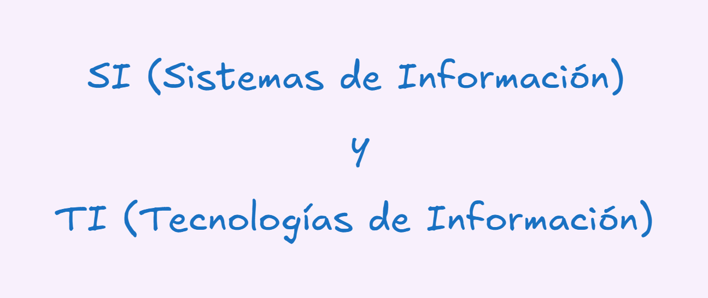
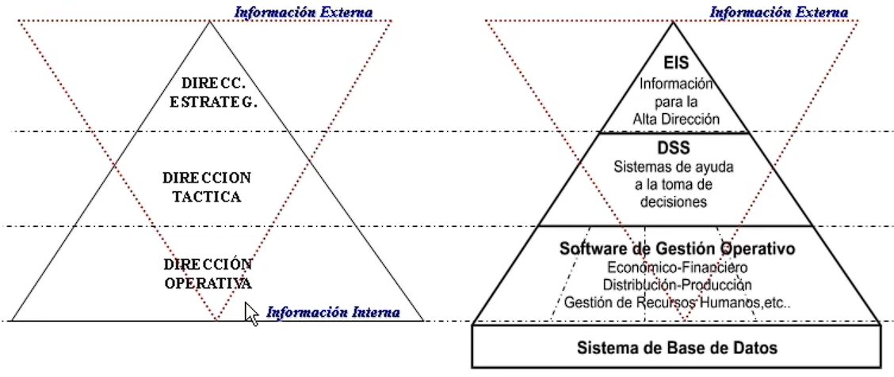
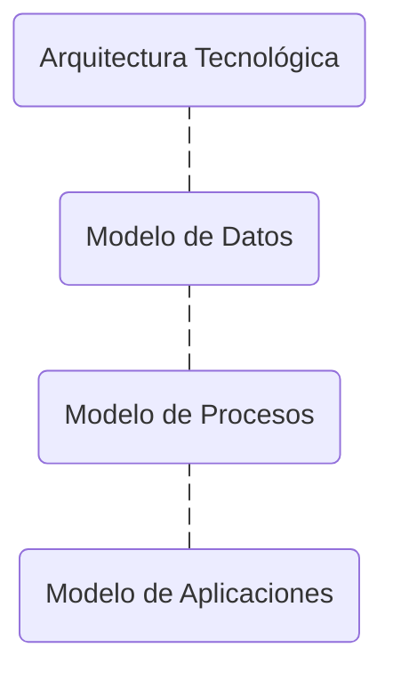

# Decisiones estratégicas en sistemas y tecnologías de la información
## Conceptos importantes:

| **Sistemas de Información** | **Tecnologías de Información** |
|:---------------------------:|:------------------------------:|
|      Son un conjunto formal de procesos que, operando sobre una colección de datos estructurados en función de las necesidades específicas del negocio, recopila, elabora y distribuye la información necesaria para la operación de la organización.      |     Son los recursos tecnológicos (hardware, software) que constituyen el soporte físico y lógico para el tratamiento automatizado de la información.     |

## Pirámide de decisiones

- **Dirección operativa**

    Se encarga de que los procesos de negocio funcionen sin errores. La generación de los datos reflejan la operatividad del día a día.

- **Dirección táctica**

    Enfocada a la toma de decisiones a mediano plazo, la dirección táctica se encarga de la recopilación de la información interna para la toma de decisiones, planificación o control.

- **Dirección estratégica**
    
    Se encarga de la recopilación de la información **externa**, con el fin de generar estrategias que signifiquen un beneficio para la empresa.
    Quienes operan en esta capa son el director de tecnología y el director general.

## Integración de la infraestructura

La integración asegura que la tecnología no sea solo una herramienta, sino un pilar de la organización, donde cualquier cambio debe alinearse al modelo original y lograr un principio de consistencia.
