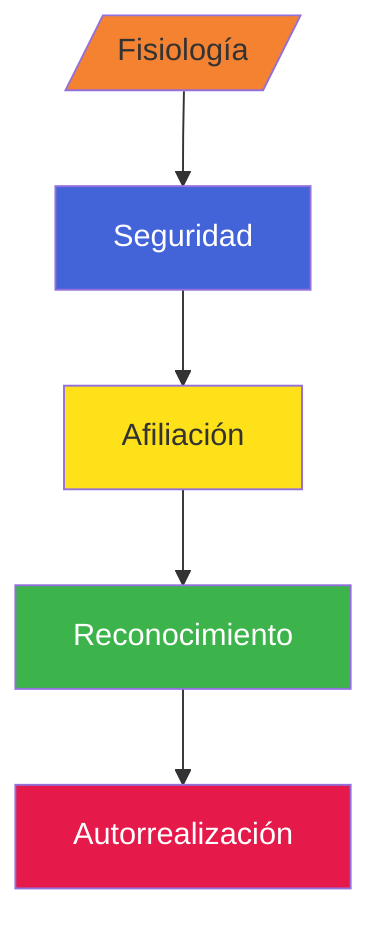

# Decisiones Estratégicas (El "Qué" y "Para qué")

- Quienes tomas estas decisiones (C-Level, Directivos) y su duración (largo plazo, 3-5 años).
- PUNTO CLAVE: Se enfocan en la misión. Ejemplo: "Queremos ser la empresa líder en seguridad de datos en la nube".
- RELACIÓN: Determinan qué tecnología se va a comprar a gran escala.

# Decisiones Tácticas (El "Cómo")

- Mandos medios (Gerentes de TI). Plazo medio (meses a 1 año).
- PUNTO CLAVE: Planifican el uso de recursos para cumplir la estrategia. Ejemplo: "Para ser líderes en seguridad, vamos a implementar una arquitectura de Zero Trust y migrar a servidores dedicados".
- RELACIÓN: Es el puente entre el sueño (Estrategia) y la realidad (Operación).

# Decisiones Operativas (El "Día a día")

- Supervisores y técnicos. Corto plaxo (diario/semanal).
- PUNTO CLAVE: Tareas rutinarias y reglas establecidas. Ejemplo: "Asignar permisos a un nuevo usuario" o "Revisar los logs de firewall cada mañana".
- RELACIÓN: Es donde el software y el hardware realmente "trbajan".

# Integración de la infreastrucura de TI
- INTEROPERABILIDAD: ¿Cómo hacen que un servidor Linux se hable con un cliente "indows o una base de datos antigua?
- ESCALABILIDAD: ¿Que pasa si la decisión estratégica es crecer el doble en un mes?

EJEMPLOS REALES:
- ERP (SAP, Oracle): Centrelizan todas las decisiones de la empresa.
- Contenedores (Docker/Kubernetes): Una decisión táctica para desplegar software rápido y estable.
- Monitoreo (Zabbix, Grafana): Herramientas operativas para ver que todo esté en orden.